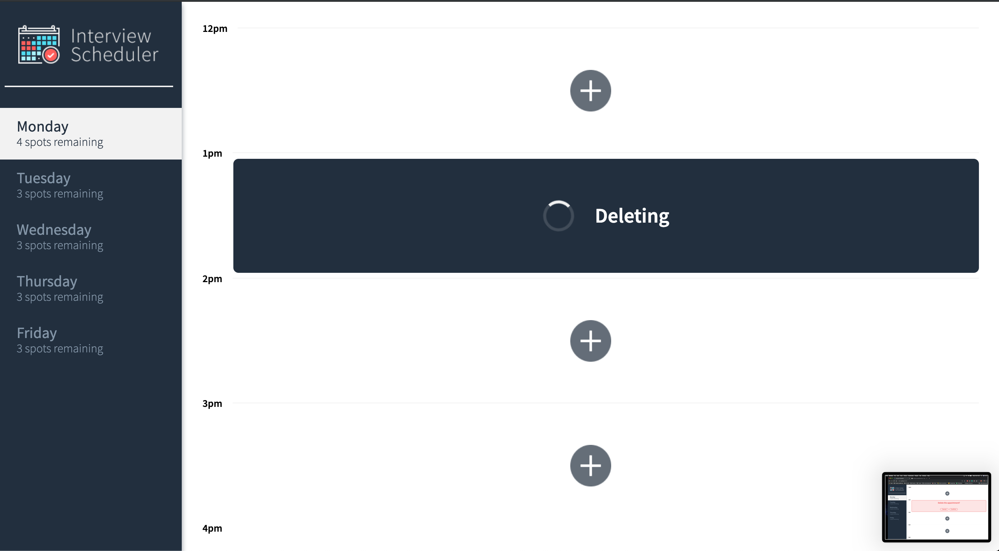

# Interview Scheduler

Interview Scheduler is a web application for educational purposes built with React and Storybook that uses Jest and Cypress for testing and allows users to book an appointment to the given week.

## Setup

Install dependencies with `npm install`.

### Running API Server

Fork [Scheduler API](https://github.com/lighthouse-labs/scheduler-api) and follow the README.md file!

### Running Webpack Development Server

```sh
npm start
```

### Running Jest Test Framework

```sh
npm test
```

### Running Storybook Visual Testbed

```sh
npm run storybook
```

## Final Product

#### _Scheduler single page view_


#### _Adding a new appointment_


#### _Deleting an existing appointment_


#### _Delete process after confirmation_


